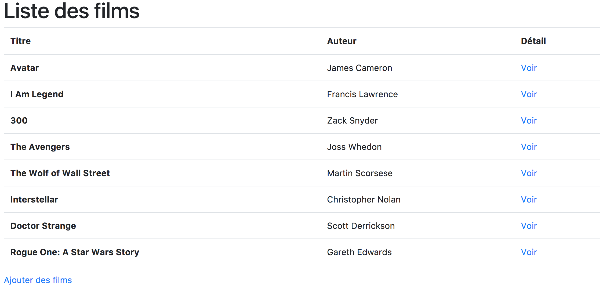
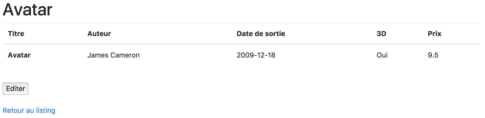
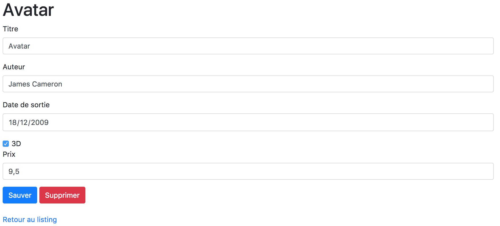
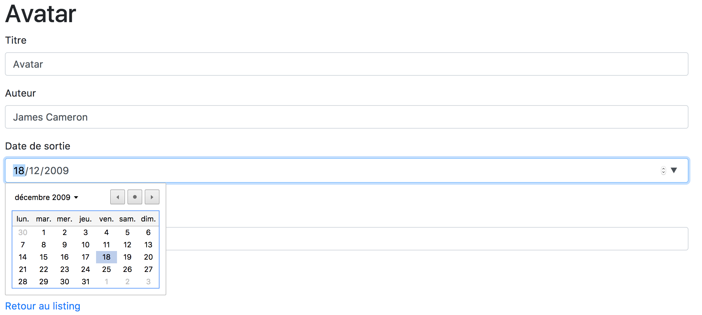
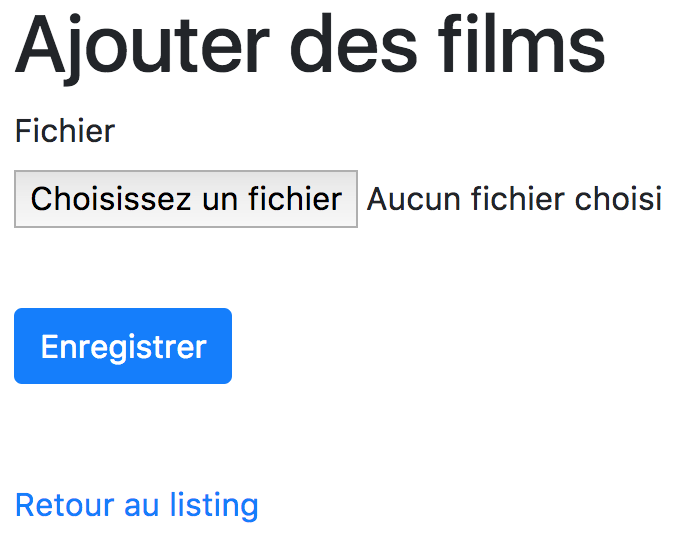
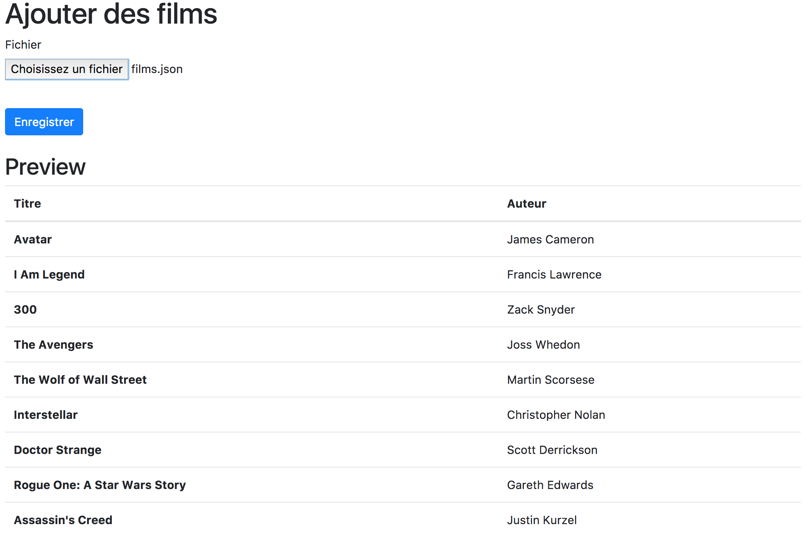

Vidéothèque
===========

Mise en situation
-----------------

Un client d'une vidéothèque souhaite disposer
d'un site internet permettant de gérer sa base de données.

Limitations
-----------

Le site web permettra à l'utilisateur de:

- lister les films de la base de données
- voir le détail d'un film
- éditer un film
- supprimer un film
- importer des films depuis un fichier json

Le site sera développé en PHP (sans framework).

Les données sont stockées dans une base de données MySQL.

La skin (CSS) sera basée sur bootstrap (https://getbootstrap.com).

Une librairie jQuery sera présente.

Structure
---------

Vous disposez déjà d'une structure du site respectant le modèle MVC.

- index.php fait office de routeur.
- le dossier controllers comporte l'ensemble des controlleurs.
- le dossier models comporte le modèle film ainsi que la connexion à la db.
- le dossier views comporte les différentes vues utilisées ainsi que la layout et le dossier js.

la layout dispose déjà de la stylesheet bootstrap, du jquery et du javascript "event" qui se trouve dans le dossier view/js.

Dans le dossier data, deux fichiers:

- film.sql: dump du schéma de la table film.
- films.json: fichier au format json contenant des films.

Note: Pour importer le dump depuis phpmyadmin, vous devez d'abord créer une base de données.

Ensuite, dans la base données, cliquez sur l'onglet "importer".

Enfin, choisissez le fichier film.sql et cliquez sur le bouton Exécuter.

Développement
=============

Accueil
-------

En page d'accueil, vous retrouverez la liste des films (Titre + Auteur).

A droite de chaque film, un lien permettra de voir le détail d'un film.

En bas de la page d'accueil, un lien redirigera l'utilisateur vers le formulaire d'importation des films.

Détail
------

Sur la page détail, un tableau reprendra l'ensemble des informations d'un film.

En bas du tableau, deux liens (ou boutons) permettront d'éditer le film ou de le supprimer.

L'identifiant du film (permettant d'afficher les données) sera envoyé en GET par la request.

Edition
-------

La page d'édition reprendra l'ensemble des données (SAUF l'identifiant unique) d'un film.

Il sera possible d'éditer les données: titre, auteur, date_sortie, 3d, prix.

En bas du formulaire, un bouton permettra de sauver la modification.

Une fois terminé, l'utilisateur sera redirigé vers la page détail du film afin de pouvoir visualiser ses modifications.

L'identifiant du film (permettant d'éditer les données) sera envoyé en GET par la request.

Les données du formulaire seront envoyées en POST.

Attettion, il faut prendre en compte le type de donnée pour les inputs (exemple: date de sortie est une date et non un texte).

Suppression
-----------

La suppression d'un film se fera depuis le bouton (ou lien) situé dans la page détail d'un film.

Une fois supprimé, l'utilisateur sera redirigé sur la page d'accueil (listing des films).

Importation
-----------

La page d'importation des films comportera un formulaire proposant à l'utilisateur de charger un fichier au format JSON (il ne pourra pas charger un autre format).

Une fois que l'utilisateur aura rempli le formulaire, une prévisualisation du contenu sera affiché en bas de page.

L'utilisateur pourra enfin confirmer l'importation de ses données et sera ensuite redirigé vers la page d'accueil.

Les données du formulaire seront envoyées en POST.

Prévisualisation (depuis la vue importation)
--------------------------------------------

Pour cette prévisualisation, il sera nécessaire d'utiliser AJAX afin de charger le contenu du fichier, l'envoyer à une vue et retourner le contenu (html) de la vue en bas de la page d'importation.

Le tout de façon asynchrone et dynamique (pas de chargement ou refresh de la vue importation).

Attention, la prévisualisation ne fait aucune insertion en db !

Il affichera un tableau reprenant le titre et l'auteur des films contenu dans le fichier json.

Configuration
-------------

Editer le fichier models/db.php avec les informations correspondant à votre db MySQL.
